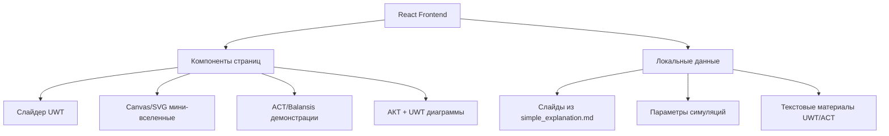
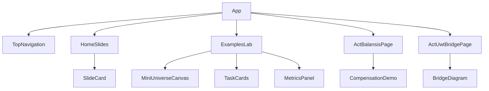

## 1. Архитектурный дизайн



Приложение является статическим SPA без backend. Все данные встроены локально, чтобы интерфейс работал быстро и не зависел от внешних сервисов.

## 2. Описание технологий

- Frontend: React 18 + Vite.
- Стили: CSS Modules или обычный CSS с CSS variables.
- Визуализации: SVG/Canvas внутри React-компонентов.
- Данные: локальные TypeScript/JavaScript структуры.
- Сборка: Vite.
- Backend: не требуется.
- Внешние сервисы: не требуются.

Причина выбора: приложение демонстрационное, визуальное и статическое. React + Vite достаточно для вкладок, состояния симуляций, слайдов и интерактивных схем.

## 3. Определение маршрутов

Так как приложение имеет 4 вкладки, маршрутизацию можно реализовать через состояние вкладок без `react-router`.

| Маршрут/вкладка | Назначение |
|---|---|
| `/` или `home` | Главная с 17 слайдами |
| `examples` | Примеры, мини-вселенные, практические задачи |
| `act` | Абсолютно Компенсационная Теория и Balansis |
| `bridge` | Связь АКТ + UWT |

## 4. API

Backend API не используется.

Локальные типы данных:

```ts
type Slide = {
  id: number;
  title: string;
  body: string;
  formula?: string;
};

type UniverseNode = {
  id: number;
  x: number;
  y: number;
  stability: number;
};

type UniverseEdge = {
  source: number;
  target: number;
  relation: number;
  distance: number;
};

type PracticalTask = {
  title: string;
  problem: string;
  uwtSolution: string;
};
```

## 5. Компонентная архитектура



## 6. Модель данных

Данные хранятся в `src/data/`:

- `slides.js` — 17 слайдов на основе `simple_explanation.md`.
- `tasks.js` — практические задачи.
- `actConcepts.js` — объяснение АКТ и Balansis.

## 7. Производительность

- Canvas/SVG-сцены ограничены десятками узлов.
- Анимации выполняются через `requestAnimationFrame` или CSS transitions.
- Без тяжёлых 3D-библиотек на первом этапе.
- Интерфейс должен запускаться локально через `npm run dev`.

## 8. Структура файлов

```text
Unified Whole Theory/web-app/
├─ package.json
├─ index.html
├─ src/
│  ├─ App.jsx
│  ├─ main.jsx
│  ├─ styles.css
│  ├─ data/
│  │  ├─ slides.js
│  │  ├─ tasks.js
│  │  └─ actConcepts.js
│  └─ components/
│     ├─ TopNavigation.jsx
│     ├─ HomeSlides.jsx
│     ├─ ExamplesLab.jsx
│     ├─ MiniUniverseCanvas.jsx
│     ├─ ActBalansisPage.jsx
│     └─ ActUwtBridgePage.jsx
```
