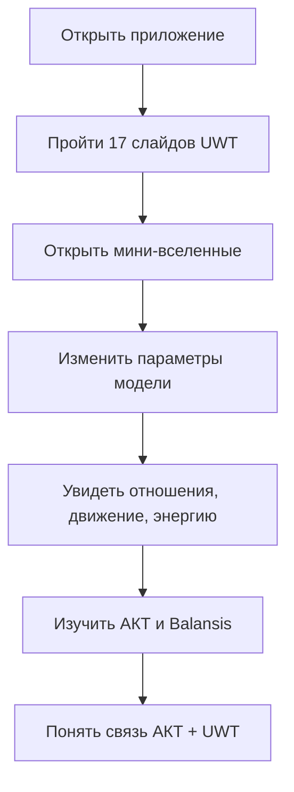

## 1. Обзор продукта

Веб-приложение **Unified Whole Theory Explorer** — современная интерактивная витрина UWT/ТЕЦ с объяснением, демонстрациями мини-вселенных, визуализациями и связью с АКТ/Balansis.
- Цель: сделать сложную теорию понятной через слайды, симуляции, интерактивные схемы и практические задачи.
- Ценность: образовательный, исследовательский и демонстрационный интерфейс для представления UWT, ACT и их совместной вычислительной модели.

## 2. Основные функции

### 2.1 Роли пользователей

Разделение ролей не требуется. Приложение предназначено для одного типа пользователя: читатель/исследователь.

### 2.2 Функциональные модули

1. **Главная**: 17 слайдов по материалу `simple_explanation.md`, навигация, прогресс, кинематографичная подача.
2. **Примеры и мини-вселенные**: интерактивная визуализация частей, отношений, расстояний, устойчивости, энергии и практических задач.
3. **АКТ и Balansis**: объяснение Абсолютно Компенсационной Теории, демонстрация устойчивых вычислений и смысл библиотеки Balansis.
4. **АКТ + UWT**: визуальная схема связи компенсационных вычислений и реляционной модели UWT, объяснение совместного применения.

### 2.3 Детализация страниц

| Страница | Модуль | Описание функций |
|---|---|---|
| Главная | Слайдер 17 слайдов | Показывает объяснение UWT простыми словами, кнопки вперед/назад, индикатор прогресса, мини-навигация по темам |
| Главная | Hero-зона | Название UWT/ТЕЦ, короткая формула, атмосферная визуализация отношений |
| Примеры | Мини-вселенная | Узлы-части, линии-отношения, изменение состояния, метрика, скорость, энергия |
| Примеры | Практические задачи | Карточки: сети, устойчивость, прогнозы, важные узлы, резкие изменения, внутреннее время, ИИ-агенты |
| Примеры | Панель параметров | Управление количеством частей, скоростью изменения, включение/выключение связей |
| АКТ/Balansis | Демонстрация компенсации | Пример потери точности обычной суммы и сохранения остатка через идею Balansis |
| АКТ/Balansis | Карточки понятий | AbsoluteValue, compensation, singular arithmetic, audited numerical semantics |
| АКТ + UWT | Объединённая схема | Поток: UWT даёт отношения и состояния, ACT/Balansis даёт устойчивые вычисления |
| АКТ + UWT | Исследовательская карта | Где использовать вместе: энергия, устойчивость, прогнозирование, проверка численных моделей |

## 3. Основной пользовательский процесс

Пользователь открывает приложение, проходит 17 слайдов на главной, затем переходит к интерактивным мини-вселенным, смотрит практические задачи, изучает АКТ/Balansis и завершает пониманием того, как АКТ усиливает вычислительную реализацию UWT.

## 4. Дизайн интерфейса

### 4.1 Стиль дизайна

- Направление: **научный ретро-футуризм + музей цифровой космологии**.
- Основные цвета: глубокий графит `#080A0F`, холодный синий `#2F80ED`, янтарный `#FFB347`, мягкий белый `#F4F1E8`.
- Акценты: тонкие светящиеся линии отношений, полупрозрачные стеклянные панели, зернистый фон.
- Кнопки: вытянутые капсулы, стеклянная поверхность, тонкая световая кайма.
- Шрифты: выразительный заголовочный serif/display, читаемый текстовый sans/serif без стандартной «AI»-стерильности.
- Макет: desktop-first, крупные композиции, асимметрия, интерактивные панели справа/слева.
- Иконки: минимальные геометрические пиктограммы без эмодзи.

### 4.2 Обзор страниц

| Страница | Модуль | UI-элементы |
|---|---|---|
| Главная | Слайды | Большая типографика, прогресс-лента, кнопки навигации, фоновая сеть узлов |
| Примеры | Мини-вселенная | Canvas/SVG-сцена, узлы, связи, численные индикаторы, параметры |
| АКТ/Balansis | Компенсация | Split-screen: обычная арифметика против компенсационной, карточки API |
| АКТ + UWT | Объединение | Большая диаграмма потоков, интерактивные подсказки, финальная формула |

### 4.3 Адаптивность

Desktop-first. На мобильных устройствах вкладки превращаются в верхнюю прокручиваемую навигацию, визуализации уменьшаются, панели параметров складываются в аккордеоны.

### 4.4 3D/визуальная сцена

Полноценная 3D-сцена не обязательна. Основные визуализации можно сделать через Canvas/SVG для высокой производительности:
- узлы как части Единого Целого;
- линии как отношения;
- изменение толщины/цвета линий как изменение интенсивности;
- энергия как светимость системы;
- устойчивость как плотность/сгущение связей.

## Актуальное состояние (2026-07-13)

Все 4 модуля исходного PRD реализованы; продукт вырос за его рамки:

- добавлены разделы MagicBrain, Donate (Stripe) и Monograph (полный LaTeX с
  KaTeX-рендером и глоссарием символов);
- двуязычность RU/EN с переключателем в шапке;
- Browser Python Runner (Pyodide) с установкой balansis/magicbrain прямо в
  браузере;
- футер с контактами (uwt@xteam.pro), блоком «Как цитировать» (из CITATION.cff)
  и ссылками на LICENSE/LICENSING;
- полный SEO-контур: канонические URL разделов, JSON-LD, sitemap, пререндер.

Детали — в `uwt_web_app_architecture.md`, раздел «Актуальное состояние».
