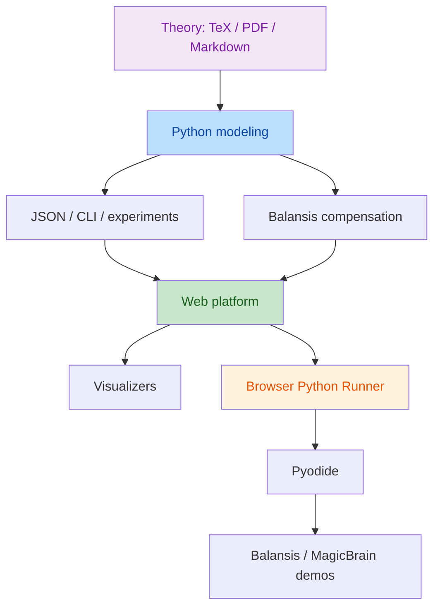
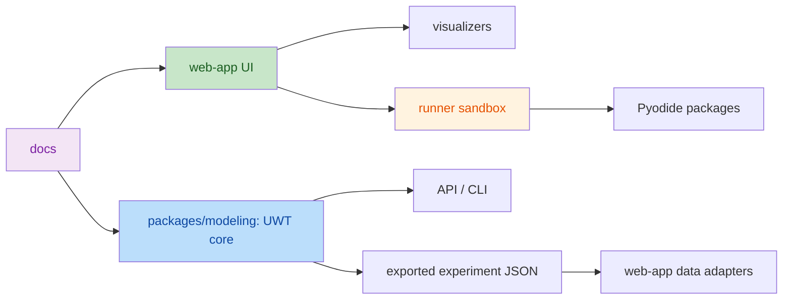

# Аудит платформы и план развития UnifiedWholeTheory

Дата аудита: 2026-07-07
Обновлено: 2026-07-09

## 1. Резюме состояния

Проект уже состоит из трёх сильных направлений:

1. **Теоретический слой** — монография, PDF/TeX/Markdown-материалы и простое объяснение UWT.
2. **Python modeling** — вычислимое ядро UWT с отношениями, метриками, прогнозом, Balansis-компенсацией и CLI.
3. **Web platform** — интерактивный React/Vite-атлас с визуализаторами UWT, вещества, мозга, электронов, ДНК, MagicBrain и исполнимыми Python/Balansis/MagicBrain-демо в браузере.

Текущие проверки:

- `web-app`: `npm run build` — успешно.
- `web-app`: `npm run lint` — успешно.
- `modeling`: `python -m pytest` — успешно, `32 passed`, без warnings.

Выполнено из плана:

- Внедрён code splitting основных страниц через `React.lazy` и `Suspense`.
- Схема верхних вкладок вынесена в единый модуль `web-app/src/data/navigation.ts`.
- Vite warning по основному chunk > 500 kB устранён: страницы собираются отдельными chunks.
- MagicBrain demo-коды, список модулей и roadmap вынесены из `MagicBrainPage.tsx` в `web-app/src/data/magicbrainDemos.ts`.
- Python-тесты расширены с 2 до 32: добавлено покрытие forecast, parameter scan, serialization, Balansis adapter, CLI, граничных значений `UWTConfig` и релятивной волновой функции (см. 3.5).
- Добавлена строгая валидация `UWTConfig`.
- pytest-asyncio warning устранён окончательно: ложная опция `asyncio_default_fixture_loop_scope` удалена из `pyproject.toml` (в проекте нет async-тестов, `pytest-asyncio` не установлен и не нужен — опция лишь маскировала предупреждение, не устраняя его причину).
- BrowserPythonRunner улучшен: добавлены статусы Python/Balansis/MagicBrain, last run duration, reset runtime, copy code/output, download JSON, timeout 15000 ms, раздельный stdout/stderr, fallback-подсказки и обновлённый UI.
- Добавлен корневой `check-all.ps1`: единая проверка web build, web lint и Python pytest.
- Добавлен модуль релятивной волновой функции `uwt_modeling.wavefunction` с UI-визуализатором в web-app (см. 3.5).

Техническое состояние можно оценить как **рабочий исследовательский прототип**, близкий к demonstrator/MVP. Для превращения в устойчивую платформу нужны систематизация архитектуры, тестовое покрытие, упаковка вычислительного ядра, улучшение исполнения Python в браузере и продуктовая навигация.

## 2. Архитектура проекта

## 3. Сильные стороны

### 3.1 Теория и контент

- Есть отдельные теоретические документы в `theory/` и `papers/`.
- Есть простое объяснение для входа в тему.
- Структура проекта уже отделяет теорию, моделирование и интерфейс.

### 3.2 Python modeling

- Есть отдельный installable-пакет `uwt-modeling`.
- Есть CLI `uwt-model`.
- Есть базовые проверки метрических аксиом и динамики.
- Используется `balansis==1.0.0` для компенсационной арифметики.
- Есть прогнозирование наблюдаемых величин.

### 3.3 Web platform

- Интерфейс уже покрывает несколько доменов: UWT, вещество, мозг, электроны, ДНК, MagicBrain.
- Есть отдельная страница MagicBrain Platform.
- Есть исполнимые демо через Pyodide.
- UI визуально цельный: тёмная научная тема, glassmorphism, responsive layout.

### 3.4 Интеграционный потенциал

- MagicBrain хорошо согласуется с UWT-моделью: нейроны как части, синапсы как отношения, память как устойчивые структуры.
- Balansis можно сделать единым вычислительным слоем для аудита энергии, устойчивости и прогнозов.

### 3.5 Волновая функция ψ (Balansis ACT quantum-like layer)

Добавлен модуль `modeling/src/uwt_modeling/wavefunction.py`, выводящий квантовоподобную волновую функцию напрямую из отношений UWT, без отдельного постулата:

- амплитуда вклада отношения (i, j) — устойчивость `w_ij = 1 / (1 + Σ|Δd_ij|)` по истории; фаза — накопленное действие `S_ij/ħ_eff` в духе интеграла по путям;
- ψᵢ(u) на каждой оси — суперпозиция круговых гауссовых пакетов на решётке `Z_N`, нормированная по правилу Борна; импульсное представление строится явной унитарной ДПФ-матрицей (без `np.fft`);
- `wavefunction_checks()` проверяет правило Борна, унитарность ДПФ (сохранение нормы Парсеваля), интерференцию (отклонение от классической смеси) и соотношение неопределённостей координата–импульс;
- интегрирован в `run_experiment()` (секция `wavefunction` в результате) и экспортирован из `uwt_modeling.__init__`;
- в web-app добавлен визуализатор `WaveFunctionSimulation.tsx`, подключённый как вкладка «Волновая» в `ExamplesLab`.

Отличительная черта модуля — жёсткая численная политика: **все** редукции (суммы по истории, суперпозиция, классическая смесь, ДПФ, нормировки) идут только через компенсированную арифметику Balansis (Кахан/Неймайер), сырых `numpy`-редукций (`np.sum`, `np.dot`, `np.matmul`, `np.fft`, `@` и т.д.) в модуле нет. Это закреплено двумя тестами в `test_wavefunction.py`:

- статическим — грепает исходник модуля на запрещённые токены;
- runtime — патчит `np.sum`/`np.dot`/`np.matmul`/`np.fft.fft` и т.п. на функции, кидающие `AssertionError`, и прогоняет вычисление ψ целиком, подтверждая, что путь исполнения их не касается.

Это даёт модулю более сильную гарантию корректности численной политики, чем у остальной части `uwt_modeling`, и может служить образцом для будущих модулей, где научная воспроизводимость критична.

## 4. Основные риски и технический долг

### 4.1 Web-app: размер и связность

Текущее предупреждение Vite:

- основной JS chunk больше 500 kB после minification.

Причины:

- все страницы импортируются синхронно в `App.tsx`;
- MagicBrain demo и Pyodide runner находятся в основном графе зависимостей;
- нет code splitting по вкладкам.

Риск: при росте платформы первый экран будет загружаться медленнее.

### 4.2 BrowserPythonRunner

Текущий runner полезен, но пока это прототип:

- Pyodide грузится из CDN;
- `micropip.install('magicbrain[balansis]')` зависит от доступности сети и совместимости wheel-пакетов;
- нет кэширования статуса установки в UI;
- нет отмены выполнения;
- нет лимитов времени выполнения;
- нет разделения stdout/stderr;
- кодовые демо захардкожены в React-компонентах.

Риск: пользователь может получить ошибку установки пакета, долгую загрузку или зависание выполнения.

### 4.3 Web-app: архитектура данных

Сейчас данные и исполнимый код находятся в TSX/TS-файлах:

- `tasks.ts` содержит большие Python-строки;
- `MagicBrainPage.tsx` содержит большие демо-коды;
- визуализаторы содержат и UI, и генерацию данных, и расчёт метрик.

Риск: рост сложности приведёт к тяжёлой поддержке и сложному тестированию.

### 4.4 Python modeling: тестовое покрытие

Сейчас есть 2 теста. Они проверяют базовую валидность, но не покрывают:

- граничные конфигурации;
- сериализацию;
- CLI;
- прогнозирование;
- parameter scan;
- Balansis adapter;
- воспроизводимость seed;
- ошибки конфигурации.

Риск: изменения в модели могут сломать научные инварианты без обнаружения.

### 4.5 Документация и developer experience

Есть README, но не хватает:

- единого “как запустить всё” из корня;
- матрицы команд для web/modeling/docs;
- описания архитектуры web-app;
- описания browser runner и его ограничений;
- troubleshooting для Pyodide/MagicBrain;
- contribution guidelines.

### 4.6 Доступность и UX QA

UI стал визуально сильным, но нужно формально проверить:

- keyboard navigation;
- screen reader labels для интерактивных SVG;
- reduced motion;
- contrast в активных/disabled состояниях;
- mobile touch targets;
- copy/paste UX для code-блоков.

### 4.7 Научная валидация

Для исследовательской платформы важно отделить:

- демонстрационные визуализации;
- вычислительные модели;
- проверяемые утверждения;
- эмпирические эксперименты.

Сейчас web-визуализаторы частично иллюстративные, а Python-модель — вычислительная. Это нужно явно маркировать, чтобы не смешивать demo и validation.

## 5. Рекомендованная целевая архитектура

Цель: отделить вычислимую модель от визуальных демонстраций и сделать web-app тонким потребителем данных/сценариев.

## 6. План улучшений

### Этап 1. Стабилизация и качество

Приоритет: высокий.

1. Включить code splitting в web-app — **выполнено**:
   - прямые импорты страниц заменены на `React.lazy`;
   - страницы вынесены в отдельные chunks;
   - Vite warning по 500 kB исчез.

2. Добавить smoke/e2e-проверку web-app:
   - открыть каждую вкладку;
   - проверить, что нет runtime ошибок;
   - проверить, что основные кнопки доступны.

3. Расширить Python-тесты — **выполнено для текущего набора модулей**:
   - добавлены тесты для `forecast.linear_forecast` и `forecast_observables`;
   - добавлены тесты для `parameter_scan`;
   - добавлены тесты для `serialization`;
   - добавлен CLI smoke-test через `subprocess`;
   - добавлены тесты для `balansis_adapter`;
   - добавлены строгие проверки граничных `UWTConfig`.

4. Зафиксировать pytest warning — **выполнено**:
   - в `pyproject.toml` добавлено `asyncio_default_fixture_loop_scope = "function"`.

5. Добавить `npm run check:all` или корневой скрипт проверки — **выполнено**:
   - добавлен `check-all.ps1` в корне проекта;
   - выполняет web build;
   - выполняет web lint;
   - выполняет python pytest.

### Этап 2. Архитектурная чистка web-app

Приоритет: высокий.

1. Вынести большие демо-коды из компонентов — **частично выполнено**:
   - MagicBrain demo-коды вынесены в `src/data/magicbrainDemos.ts`;
   - `MagicBrainPage.tsx` оставлен UI-композицией;
   - следующим шагом нужно вынести UWT/Balansis задачи из `src/data/tasks.ts` в более структурированный набор browser examples при необходимости.

2. Разделить визуализаторы на слои:
   - `model` — генерация узлов/связей/метрик;
   - `view` — SVG/контролы;
   - `page` — композиция.

3. Создать общие компоненты:
   - `MetricCard`;
   - `CodeBlock`;
   - `TabList`;
   - `GlassPanel`;
   - `SectionHeader`.

4. Убрать неиспользуемые зависимости из `package.json`, если они не нужны:
   - `react-router-dom` сейчас не используется;
   - `zustand`, `lucide-react`, `clsx`, `tailwind-merge` нужно либо применить, либо удалить.

5. Добавить centralized route/tab schema — **выполнено**:
   - единый тип `Tab` и массив вкладок вынесены в `web-app/src/data/navigation.ts`;
   - `App.tsx` и `TopNavigation.tsx` используют общий источник.

### Этап 3. Улучшение BrowserPythonRunner

Приоритет: высокий.

1. Добавить статусы пакетов — **выполнено**:
   - Python loaded;
   - Balansis installed;
   - MagicBrain installed;
   - last run duration.

2. Добавить безопасное выполнение — **выполнено для текущего runner**:
   - добавлена кнопка reset runtime;
   - повторный запуск при active run заблокирован;
   - добавлен timeout 15000 ms;
   - stdout и stderr разделены в UI.

3. Добавить copy/download для кода и результата — **выполнено**:
   - добавлено копирование кода;
   - добавлено копирование результата;
   - добавлена выгрузка результата в JSON.

4. Добавить fallback-сценарии — **частично выполнено**:
   - при ошибке CDN/Pyodide показывается подсказка по сети и режиму без runtime;
   - при ошибке установки MagicBrain показывается подсказка про визуальную SNN-демонстрацию и облегчённые примеры;
   - при ошибке установки Balansis показывается подсказка по локальному запуску через pip.

5. Рассмотреть локальную поставку Pyodide или pinned CDN integrity.

### Этап 4. Развитие Python modeling

Приоритет: средний/высокий.

1. Уточнить публичный API пакета:
   - `RelationalUniverse`;
   - `UWTConfig`;
   - `run_experiment`;
   - `forecast_observables`;
   - serializers.

2. Добавить строгую валидацию `UWTConfig` — **выполнено**:
   - `n_parts > 1`;
   - `steps >= 0`;
   - `dt > 0`;
   - `modulus > 0`;
   - `dim > 0`;
   - также проверяются `ell0`, `max_step`, `forecast_horizon`.

3. Улучшить прогнозирование:
   - оставить linear baseline;
   - добавить moving average;
   - добавить confidence band;
   - добавить сравнение прогноза с holdout history.

4. Добавить experiment registry:
   - именованные сценарии;
   - seed matrix;
   - экспорт CSV/JSON;
   - сравнение параметров.

5. Добавить notebook/examples:
   - сети и связи;
   - устойчивость;
   - внутреннее время;
   - резкие события;
   - MagicBrain-like graph.

### Этап 5. MagicBrain как отдельный продуктовый модуль

Приоритет: средний.

1. Разделить MagicBrain page:
   - overview;
   - SNN simulator;
   - executable demos;
   - API reference;
   - troubleshooting.

2. Добавить реальные capability badges:
   - работает в браузере;
   - требует сеть;
   - требует optional dependencies;
   - demo/fallback mode.

3. Добавить visual mapping UWT ↔ MagicBrain:
   - neuron = Aᵢ;
   - synapse = R(Aᵢ,Aⱼ);
   - spike = ΔR event;
   - stable memory = low ΔR cluster;
   - genome = generative law.

4. Добавить демо “MagicBrain + Balansis energy audit”:
   - взять синаптические веса;
   - посчитать energy через Balansis;
   - показать compensation.

5. Рассмотреть backend-mode:
   - FastAPI локально;
   - browser runner только для lightweight demos;
   - тяжёлые MagicBrain demo выполнять на сервере.

### Этап 6. UX, a11y и дизайн-система

Приоритет: средний.

1. Добавить `prefers-reduced-motion` для анимаций.
2. Добавить явные `aria-label` для SVG-областей и tab-групп.
3. Добавить keyboard navigation для внутренних вкладок.
4. Добавить visible labels для runner output.
5. Добавить copy buttons для code-blocks.
6. Провести ручной responsive QA на ширинах:
   - 360;
   - 768;
   - 1024;
   - 1440.

### Этап 7. Документация и релизная готовность

Приоритет: средний.

1. Обновить root README:
   - команды запуска web-app;
   - команды запуска modeling;
   - команды проверки;
   - структура проекта.

2. Добавить `docs/architecture.md`:
   - схема слоёв;
   - data flow;
   - browser runner constraints;
   - relation between UWT, Balansis, MagicBrain.

3. Добавить `docs/testing.md`:
   - web checks;
   - python checks;
   - manual QA checklist.

4. Добавить changelog.

5. Добавить release checklist.

## 7. Конкретные next actions

Рекомендуемый порядок ближайших изменений:

1. **Code splitting web-app** — снизить initial bundle и убрать Vite warning.
2. **Вынести MagicBrain demos из TSX** — уменьшить связанность и упростить поддержку.
3. **Создать общие UI-компоненты** — стабилизировать дизайн-систему.
4. **Расширить Python-тесты до 15–25 кейсов** — закрепить научные инварианты.
5. **Улучшить BrowserPythonRunner** — статусы, timeout, copy, reset.
6. **Обновить README и добавить docs/architecture.md**.
7. **Добавить маркировку demo vs verified model** в UI.

## 8. Метрики готовности

### Технические

- `npm run build` без warnings по chunk size или с осознанным manualChunks.
- `npm run lint` без ошибок.
- `python -m pytest` минимум 20 тестов.
- Покрытие Python-модели минимум 70%, затем 85%.
- Все основные страницы lazy-loaded.

### UX

- Все вкладки доступны с клавиатуры.
- Все SVG имеют осмысленные `aria-label`.
- Runner сообщает состояние загрузки/установки/ошибки понятно.
- Code blocks можно копировать.
- Мобильный layout не требует горизонтального скролла.

### Научная валидность

- Каждая проверяемая формула имеет тест или эксперимент.
- Каждая визуализация помечена как demo или verified.
- Для прогнозов есть baseline и ошибка на holdout.
- Для Balansis есть проверка компенсации на численных сценариях.

## 9. Итоговая оценка

Текущий проект — сильный исследовательский прототип с хорошим визуальным слоем и рабочим вычислительным ядром. Главный следующий шаг — превратить набор демонстраций в поддерживаемую платформу:

- отделить данные и демо-код от UI;
- усилить тесты;
- стабилизировать browser execution;
- описать архитектуру;
- оптимизировать bundle;
- формально разделить иллюстрации и проверяемые модели.

После выполнения этапов 1–3 проект можно считать устойчивым MVP. После этапов 4–7 — полноценной исследовательской платформой для UWT, Balansis и MagicBrain.
