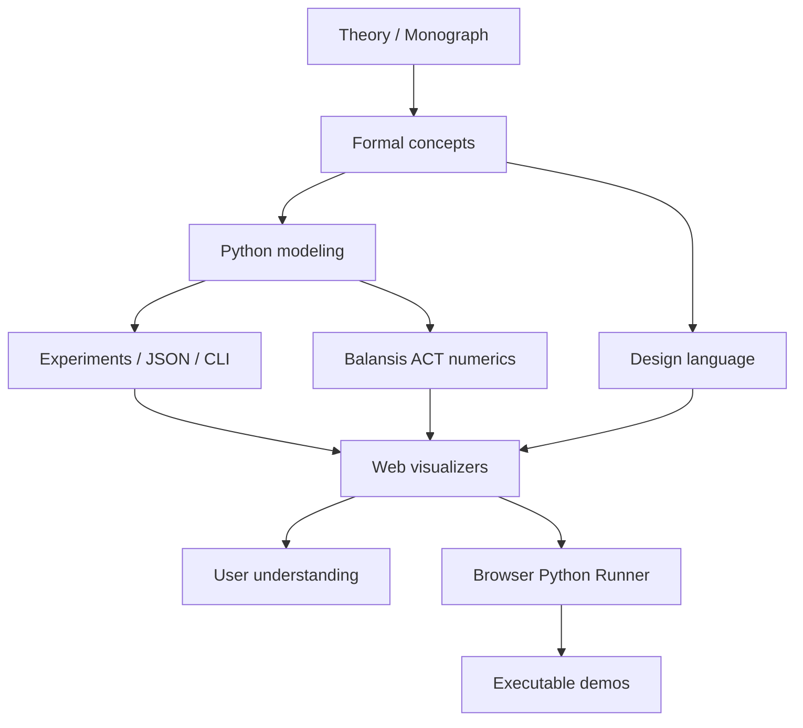

# SKILL.md — UWT Agentic Development & Design Team Skill

Версия: 1.0  
Область действия: весь каталог `UnifiedWholeTheory/` и все его подпроекты.  
Цель: дать агентной команде разработки, дизайна, научной редакции и QA единый операционный стандарт работы над сайтом и исследовательской платформой UWT.

---

## 0. Краткое назначение навыка

Этот файл описывает, как агентная команда должна развивать UWT-сайт как научно-техническую платформу, где одновременно существуют:

1. **Монография / теория** — первичный смысловой слой UWT / ТЕЦ.
2. **Визуализаторы** — интерактивные объясняющие модели для пользователя.
3. **Python modeling** — вычислимое ядро проверки, прогнозирования и моделирования.
4. **Browser Python Runner** — исполнимые демо-коды в браузере.
5. **ACT / Balansis** — слой компенсационной арифметики и численной политики.
6. **MagicBrain** — продуктово-исследовательский модуль, связывающий UWT с нейросетевыми, когнитивными и агентными структурами.

Главный принцип: **UWT-сайт не является обычным лендингом. Это исследовательский атлас, вычислимая лаборатория и интерфейс к монографии.** Любое изменение должно усиливать связь между смыслом, визуализацией, вычислением и проверяемостью.

---

## 1. Базовая картина проекта

Текущая логика проекта:

```text
UnifiedWholeTheory/
  theory/      -> монография, LaTeX/Markdown/PDF, основной теоретический корпус
  papers/      -> отдельные документы, решения открытых задач, дополнительные статьи
  modeling/    -> Python-пакет uwt-modeling, CLI, тесты, эксперименты
  web-app/     -> React/Vite web-платформа, визуализаторы, Python runner, страницы сайта
  check-all.ps1 -> единая проверка web build, web lint, Python pytest
```

Философия архитектуры:



Агент обязан помнить: теория, визуальный слой и вычислительный слой должны быть связаны, но не смешаны. Визуализация может быть иллюстрацией, но не должна выдавать себя за доказанную модель без проверки.

---

## 2. Главная миссия агентной команды

Сделать UWT-платформу:

- **понятной** — человек без подготовки должен войти через простые визуальные объяснения;
- **глубокой** — исследователь должен найти монографию, формализацию, код, эксперименты;
- **вычислимой** — ключевые утверждения должны иметь модель, тест, эксперимент или явную маркировку гипотезы;
- **красивой** — интерфейс должен ощущаться как научный атлас живой теории, а не как шаблонный сайт;
- **надёжной** — сборка, lint, pytest и ручной QA обязательны перед завершением задачи;
- **расширяемой** — каждая новая страница, визуализация, модель и демо должны встраиваться в общую систему.

---

## 3. Неприкосновенные принципы

### 3.1. Не искажать теорию

Запрещено:

- переписывать смысл UWT так, будто это обычная физическая теория без философского слоя;
- заменять термины на случайные популярные аналоги;
- заявлять доказанность там, где есть гипотеза, демонстрация или визуальная метафора;
- смешивать UWT, ACT, Balansis и MagicBrain в один термин без объяснения связей;
- удалять монографический, математический или философский слой ради упрощения интерфейса.

Разрешено:

- адаптировать сложные идеи для разных уровней пользователя;
- добавлять пояснения, схемы, глоссарий и интерактивные модели;
- разделять текст на уровни: простой, технический, исследовательский;
- предлагать уточнение формулировок, если они повышают строгость.

### 3.2. Всегда различать уровни достоверности

Каждый научный или визуальный блок должен быть отнесён к одному из уровней:

| Маркер | Значение |
|---|---|
| `THEORY` | утверждение из теоретического корпуса / монографии |
| `HYPOTHESIS` | гипотеза, требующая проверки |
| `DEMO` | визуальная или интерактивная иллюстрация |
| `MODEL` | вычислимая модель с определёнными параметрами |
| `VERIFIED` | проверяемое поведение, покрытое тестом или экспериментом |
| `EXPERIMENT` | сценарий запуска, создающий данные/JSON/график |
| `INTERPRETATION` | объяснение результата, не равное доказательству |

В UI это желательно показывать бейджами: `Теория`, `Гипотеза`, `Демо`, `Модель`, `Проверено`, `Эксперимент`, `Интерпретация`.

### 3.3. Все изменения должны быть воспроизводимыми

Для разработки:

```powershell
cd "UnifiedWholeTheory"
.\check-all.ps1
```

Для web:

```powershell
cd "UnifiedWholeTheory\web-app"
npm install
npm run dev
npm run build
npm run lint
npm run check
```

Для modeling:

```powershell
cd "UnifiedWholeTheory\modeling"
python -m pip install -e .[test]
python -m pytest
uwt-model --steps 200 --parts 24 --out results/run.json
```

Если агент не запускал проверку, он обязан явно написать это в отчёте.

---

## 4. Роли агентной команды

Одна задача может выполняться несколькими агентами. Каждый агент обязан действовать в своей зоне ответственности и не ломать соседние слои.

### 4.1. Product / Research Architect Agent

Отвечает за:

- целостность платформы;
- карту разделов сайта;
- связь монографии, визуализаторов, моделей и демо;
- приоритеты задач;
- разделение `demo` и `verified model`;
- постановку issues для команды.

Должен проверять:

- не появилась ли новая страница без места в общей навигации;
- не дублирует ли новый визуализатор старый;
- есть ли у новой модели объяснение, параметры и ограничения;
- понятно ли, зачем пользователь видит этот блок.

Выходной артефакт:

- architecture note;
- issue decomposition;
- acceptance criteria;
- roadmap section;
- PR review summary.

### 4.2. Scientific Editor / Monograph Agent

Отвечает за:

- тексты монографии;
- теоретические разделы;
- терминологию;
- глоссарий;
- пояснения для разных уровней;
- корректность ссылок между theory, papers, modeling и web.

Обязан:

- сохранять смысл UWT / ТЕЦ;
- явно отмечать гипотезы;
- не превращать философскую формулировку в физический закон без формализации;
- не удалять сложность, а делать её навигируемой;
- предлагать формальные определения там, где они нужны для моделирования.

Особо важные термины:

- Единое Целое;
- часть;
- отношение;
- различимость;
- связность;
- устойчивость;
- внутреннее время;
- энергия отношений;
- компенсация;
- ACT / АКТ;
- Balansis;
- MagicBrain;
- волновая функция из отношений;
- память как устойчивая структура отношений.

### 4.3. Frontend Platform Agent

Отвечает за:

- React/Vite архитектуру;
- TypeScript-типизацию;
- компоненты;
- lazy loading;
- навигацию;
- состояние интерфейса;
- сборку и lint.

Обязательные правила:

- не импортировать тяжёлые страницы синхронно в основной bundle;
- использовать `React.lazy` / `Suspense` для крупных страниц;
- общую навигацию держать в `web-app/src/data/navigation.ts`;
- большие демо-коды не хранить внутри TSX-компонентов;
- UI-компоненты отделять от генерации данных;
- повторяющиеся паттерны выносить в общие компоненты.

Рекомендуемая структура для новых блоков:

```text
web-app/src/
  components/
    SomePage.tsx
    visualizers/
      SomeVisualizer.tsx
  data/
    someExamples.ts
    someNavigation.ts
  models/
    someVisualizerModel.ts
  utils/
    formatting.ts
```

### 4.4. Visualizer Agent

Отвечает за:

- интерактивные визуализаторы;
- графы отношений;
- схемы вещества, мозга, электронов, ДНК, UWT, ACT и MagicBrain;
- визуальную связь между понятиями и вычислениями.

Визуализатор обязан иметь:

- понятный заголовок;
- краткую научную идею;
- параметры управления;
- подписи осей / узлов / связей;
- легенду или объяснение цвета;
- бейдж достоверности (`DEMO`, `MODEL`, `VERIFIED` и т.д.);
- состояние пустых данных;
- состояние ошибки;
- мобильную адаптацию;
- поддержку reduced motion.

Стандарт разделения:

```text
model -> вычисляет узлы, связи, метрики, состояния
view  -> рисует SVG/canvas/DOM
page  -> объясняет смысл и собирает UI
```

Запрещено:

- делать красивую анимацию без смысловой связи с UWT;
- использовать случайные данные без seed и без маркировки;
- скрывать параметры модели;
- выдавать декоративную схему за научный результат.

### 4.5. Browser Python Runner Agent

Отвечает за:

- исполняемые Python-демо в браузере;
- Pyodide runtime;
- вывод stdout/stderr;
- статусы загрузки;
- экспорт результатов;
- безопасное UX-поведение при ошибках.

Runner должен показывать:

- загружен ли Python runtime;
- установлены ли необходимые пакеты;
- выполняется ли код сейчас;
- длительность последнего запуска;
- stdout;
- stderr;
- JSON/export, если результат структурированный;
- понятную ошибку, если Pyodide/CDN/package install недоступны.

Runner не должен:

- зависать без timeout;
- запускать повторное выполнение поверх активного;
- смешивать stdout и stderr;
- скрывать ошибку установки пакета;
- делать вид, что браузерный demo равен полноценному backend execution.

Для тяжёлых экспериментов использовать backend-mode / CLI / локальный Python, а browser runner оставлять для lightweight demos.

### 4.6. Python Modeling Agent

Отвечает за:

- пакет `uwt-modeling`;
- `RelationalUniverse`;
- `UWTConfig`;
- CLI `uwt-model`;
- эксперименты;
- сериализацию;
- forecast;
- parameter scan;
- wavefunction;
- тесты.

Обязательные правила:

- сохранять публичный API;
- добавлять тест на каждую новую вычислимую сущность;
- валидировать конфигурацию;
- поддерживать воспроизводимость через seed;
- экспортировать результаты в JSON-совместимом виде;
- отделять численный метод от интерпретации;
- писать docstring для научных функций.

Публичный API должен оставаться понятным:

```python
from uwt_modeling import (
    UWTConfig,
    RelationalUniverse,
    run_experiment,
    relational_wavefunction,
    wavefunction_checks,
)
```

Если добавляется новая модель, она должна иметь:

- config-параметры;
- дефолтный безопасный сценарий;
- тесты;
- пример запуска;
- описание в README/docs;
- экспорт результата;
- ограничения применимости.

### 4.7. Numerics / Balansis Agent

Отвечает за:

- компенсационную арифметику;
- ACT / АКТ численную политику;
- устойчивость вычислений;
- запрет небезопасных редукций там, где нужна компенсация;
- отчёты о compensation terms.

Особенно важно для `wavefunction`:

- не использовать сырые `np.sum`, `np.dot`, `@`, FFT там, где явно закреплена политика Balansis;
- накопления выполнять через адаптеры компенсации;
- возвращать compensation metadata;
- тестировать нормировку, унитарность, интерференцию и неопределённость;
- явно указывать backend: `balansis-act`.

Если агент меняет численный код, он обязан добавить или обновить тест, который защищает численную политику.

### 4.8. UI/UX Designer Agent

Отвечает за:

- дизайн-систему;
- научную визуальную идентичность;
- иерархию страницы;
- читабельность монографии;
- UX визуализаторов;
- UX runner;
- responsive QA;
- accessibility.

Стилистическое направление:

- тёмная научная тема;
- ощущение космического/исследовательского атласа;
- glassmorphism уместен, но не должен снижать читаемость;
- акценты должны подчёркивать связи, энергию, устойчивость, целостность;
- интерфейс должен быть премиальным, но не декоративным;
- каждая анимация должна иметь смысл.

Дизайн обязан поддерживать:

- desktop 1440+;
- tablet 768–1024;
- mobile 360–430;
- keyboard navigation;
- focus states;
- readable contrast;
- reduced motion;
- clear code blocks;
- удобное чтение длинных текстов.

### 4.9. QA / Verification Agent

Отвечает за:

- сборку;
- lint;
- pytest;
- ручной QA;
- accessibility checklist;
- regression checks;
- проверку связности разделов.

Минимальная проверка перед завершением:

```powershell
cd "UnifiedWholeTheory"
.\check-all.ps1
```

Ручной QA:

- открыть все вкладки;
- проверить отсутствие runtime ошибок;
- проверить адаптивность;
- проверить визуализаторы;
- проверить runner;
- проверить copy/download;
- проверить empty/error states;
- проверить, что demo/model/verified маркировка не потеряна.

### 4.10. Documentation Agent

Отвечает за:

- README;
- docs/architecture.md;
- docs/testing.md;
- docs/visualizers.md;
- docs/modeling.md;
- docs/browser-runner.md;
- changelog;
- release checklist.

Документация должна отвечать на вопросы:

- что это за проект;
- как запустить сайт;
- как запустить модель;
- как проверить всё;
- где теория;
- где визуализаторы;
- где Python-код;
- как добавить новую страницу;
- как добавить новый эксперимент;
- как отличить demo от verified model.

---

## 5. Навигация сайта и назначение разделов

Текущая навигационная модель web-app:

| Tab | Назначение |
|---|---|
| `home` | Главная / слайды / вход в UWT |
| `examples` | Мини-вселенные, задачи, модели, визуальные эксперименты |
| `act` | ACT / Balansis, компенсационная арифметика |
| `bridge` | Связь ACT и UWT |
| `magicbrain` | MagicBrain / MetaBrain / нейро-агентная интерпретация |

При добавлении новой вкладки агент обязан:

1. Обновить `web-app/src/data/navigation.ts`.
2. Добавить lazy import в `App.tsx`.
3. Проверить мобильную навигацию.
4. Обновить README/docs при необходимости.
5. Добавить краткое объяснение, зачем раздел нужен.

Новая вкладка допустима только если она добавляет новый смысловой слой, а не просто дублирует существующую страницу.

---

## 6. Работа с монографией

### 6.1. Монография — источник смысла

Монография в `theory/` является первичным корпусом UWT. Web-app должен быть интерфейсом к ней, а не заменой. Любое крупное изменение сайта должно отвечать на вопрос: **какую часть монографии оно делает понятнее, проверяемее или нагляднее?**

### 6.2. Уровни объяснения

Для каждой сложной идеи желательно иметь 3 уровня:

1. **Simple** — короткое объяснение для нового пользователя.
2. **Technical** — формулы, параметры, структура модели.
3. **Research** — связь с монографией, ограничениями и открытыми задачами.

Пример структуры блока:

```markdown
### Отношение

**Просто:** часть существует не изолированно, а через различимость и связь с другими частями.

**Технически:** отношение можно представить как R(A_i, A_j), влияющее на расстояние, устойчивость, энергию и внутреннее время.

**Исследовательски:** отношение является мостом между мереологическим описанием целого и вычислимой моделью графа.
```

### 6.3. Правила редактирования теоретических текстов

Перед изменением текста агент должен определить:

- это терминологическая правка;
- научная формализация;
- популярное объяснение;
- UX-копирайтинг;
- исправление ошибки;
- новое утверждение.

Новое утверждение без основания должно быть помечено как `HYPOTHESIS` или вынесено в отдельную заметку.

---

## 7. Работа с визуализаторами

### 7.1. Назначение визуализаторов

Визуализаторы нужны не для красоты, а для перехода:

```text
абстрактная идея -> видимая структура -> управляемый параметр -> наблюдаемый эффект -> интерпретация
```

Каждый визуализатор должен показывать хотя бы один из аспектов:

- части;
- отношения;
- устойчивость;
- изменение;
- внутреннее время;
- энергию;
- компенсацию;
- переход от локального к целому;
- различие между иллюстрацией и вычислимой моделью.

### 7.2. Минимальный контракт визуализатора

```ts
export type VisualizerStatus = 'demo' | 'model' | 'verified' | 'experiment'

export interface VisualizerMeta {
  id: string
  title: string
  shortDescription: string
  status: VisualizerStatus
  relatedTheory?: string[]
  parameters: string[]
  limitations: string[]
}
```

Если визуализатор вычисляет данные, желательно выносить модель отдельно:

```ts
export interface VisualizerModelInput {
  seed: number
  steps: number
  nParts: number
}

export interface VisualizerModelOutput {
  nodes: unknown[]
  links: unknown[]
  metrics: Record<string, number>
}
```

### 7.3. UX визуализатора

Обязательные элементы:

- заголовок;
- объяснение;
- панель параметров;
- визуальная область;
- метрики;
- интерпретация;
- статус достоверности;
- кнопка reset;
- состояние загрузки;
- состояние ошибки.

Для mobile:

- controls должны быть над или под визуализацией;
- не должно быть горизонтального скролла;
- touch targets минимум 40px;
- сложные легенды сворачивать.

### 7.4. Анимация

Анимация разрешена, если она показывает:

- изменение отношения;
- распространение влияния;
- стабилизацию;
- распад;
- компенсацию;
- фазу;
- переход между состояниями.

Анимация запрещена, если она просто декоративная и мешает чтению.

Все анимации должны уважать:

```css
@media (prefers-reduced-motion: reduce) {
  * {
    animation-duration: 0.01ms !important;
    animation-iteration-count: 1 !important;
    transition-duration: 0.01ms !important;
  }
}
```

---

## 8. Работа с Python modeling

### 8.1. Роль modeling

`modeling/` — это не вспомогательная папка, а вычислимое ядро проекта. Здесь UWT должна становиться проверяемой через:

- конфигурации;
- историю состояний;
- метрики;
- forecast;
- parameter scan;
- wavefunction;
- JSON output;
- CLI;
- tests.

### 8.2. Новая функция modeling должна иметь

1. Типизированную функцию или класс.
2. Docstring с научным смыслом.
3. Валидацию входных параметров.
4. Тесты normal case.
5. Тесты edge case.
6. Сериализацию результата, если результат нужен web-app.
7. Пример использования.
8. Обновление README/docs.

### 8.3. Конфигурация

`UWTConfig` должен оставаться строгим. Новые параметры требуют:

- типа;
- диапазона;
- дефолта;
- объяснения;
- теста на невалидное значение.

Пример плохого изменения:

```python
new_param: float = 0.5  # непонятно зачем
```

Пример хорошего изменения:

```python
relation_decay: float = Field(
    default=0.02,
    gt=0.0,
    le=1.0,
    description="Rate at which unstable relations decay during each simulation step.",
)
```

### 8.4. Экспорт данных для web-app

Если результат моделирования нужен визуализатору, он должен экспортироваться в JSON-friendly формате:

```json
{
  "meta": {
    "model": "uwt-relational-universe",
    "version": "0.1.0",
    "seed": 42,
    "status": "MODEL"
  },
  "config": {},
  "metrics": {},
  "series": [],
  "nodes": [],
  "links": [],
  "limitations": []
}
```

Запрещено передавать в web-app сырые numpy arrays без адаптера сериализации.

---

## 9. Работа с wavefunction

Волновая функция в UWT должна трактоваться как производная от истории отношений, а не как случайно добавленный квантовый декоративный слой.

Ключевые идеи:

- амплитуда связана с устойчивостью отношения;
- фаза связана с накопленным действием;
- ψ строится на решётке;
- нормировка проверяется правилом Борна;
- импульсное представление проверяется через унитарность;
- интерференция сравнивается с классической смесью;
- численная политика идёт через Balansis/ACT.

Для любых изменений wavefunction обязательно:

```powershell
cd "UnifiedWholeTheory\modeling"
python -m pytest
```

Минимальный набор проверок:

- normalization error;
- min probability;
- Parseval / unitary transform;
- interference detection;
- uncertainty product;
- compensation metadata;
- no raw float64 reductions where forbidden.

---

## 10. Работа с ACT / Balansis

ACT / Balansis в проекте — это слой численной строгости и компенсации, а не просто импорт библиотеки.

Агент обязан:

- объяснять пользователю, где именно применяется компенсация;
- возвращать compensation values в отчётах;
- избегать скрытых сырых редукций;
- писать тесты, если меняет численную политику;
- не заменять Balansis на numpy ради простоты без отдельного решения архитектора.

Плохая практика:

```python
energy = np.sum(values)
```

Хорошая практика:

```python
energy, compensation = compensated_sum(values)
```

Если используется numpy, агент обязан понимать, является ли операция:

- безопасной поэлементной операцией;
- точной индексной операцией;
- запрещённой редукцией;
- допустимой вспомогательной трансформацией.

---

## 11. Работа с Browser Python Runner

### 11.1. Назначение

Browser Python Runner нужен, чтобы пользователь мог не просто читать теорию, а запускать минимальные вычислимые сценарии прямо в браузере.

### 11.2. Обязательные состояния UI

Runner должен иметь состояния:

- idle;
- loading runtime;
- installing packages;
- ready;
- running;
- success;
- error;
- timeout;
- reset.

### 11.3. Обязательные действия

- Run;
- Reset runtime;
- Copy code;
- Copy output;
- Download JSON;
- Show stdout;
- Show stderr;
- Show package/runtime status.

### 11.4. Ограничения

В каждом разделе runner должно быть понятно:

- это browser execution, а не backend;
- некоторые пакеты могут не установиться в Pyodide;
- тяжёлые эксперименты нужно запускать локально или на сервере;
- демо может быть упрощением полной модели.

---

## 12. Работа с MagicBrain

MagicBrain должен быть показан как мост:

```text
UWT -> отношения -> устойчивые структуры -> память -> нейронные связи -> агентное мышление
```

Рекомендуемое соответствие:

| UWT | MagicBrain |
|---|---|
| часть `A_i` | нейрон / агент / модуль |
| отношение `R(A_i, A_j)` | синапс / связь / канал влияния |
| изменение отношения | spike / событие / обучение |
| устойчивый кластер | память / паттерн |
| энергия отношений | стоимость изменения / напряжение системы |
| компенсация | стабилизация / балансировка |
| целое | MetaBrain / когнитивная система |

MagicBrain-страница должна разделяться на:

- overview;
- UWT mapping;
- SNN / graph demo;
- executable examples;
- API / architecture;
- limitations;
- roadmap.

---

## 13. Дизайн-система UWT

### 13.1. Визуальный образ

UWT-сайт должен ощущаться как:

- научный атлас;
- космическая лаборатория;
- интерактивная монография;
- интерфейс к живой теории;
- платформа исследования отношений, целостности и компенсации.

Он не должен ощущаться как:

- крипто-лендинг;
- случайный sci-fi шаблон;
- перегруженная презентация;
- академический PDF без интерфейса;
- набор несвязанных демо.

### 13.2. UI-паттерны

Рекомендуемые общие компоненты:

```text
GlassPanel
MetricCard
TheoryBadge
StatusBadge
CodeBlock
RunnerPanel
VisualizerFrame
SectionHeader
ParameterControl
InsightCard
CitationLink
```

Каждый общий компонент должен быть:

- типизирован;
- переиспользуем;
- адаптивен;
- доступен с клавиатуры, если интерактивен;
- без захардкоженного текста, если текст относится к конкретной странице.

### 13.3. Читабельность

Для длинных текстов:

- ширина колонки не должна быть слишком большой;
- использовать подзаголовки;
- добавлять якоря;
- добавлять summary-блоки;
- формулы отделять визуально;
- давать переход к связанному визуализатору.

### 13.4. Цвет и смысл

Цвета должны иметь смысл:

- синий/циан — структура, связь, информация;
- фиолетовый — теория, целое, абстракция;
- зелёный — устойчивость, проверка, verified;
- оранжевый — энергия, изменение, warning;
- красный — ошибка, распад, contradiction;
- серый — disabled, unknown, not verified.

Не использовать цвет как единственный способ передачи смысла. Добавлять текст/иконки/паттерны.

---

## 14. Accessibility и UX QA

Обязательные проверки:

- keyboard navigation;
- visible focus;
- `aria-label` для интерактивных SVG;
- `button`, а не `div`, для кликабельных действий;
- reduced motion;
- contrast;
- mobile tap targets;
- readable code blocks;
- no horizontal scroll on mobile;
- error messages understandable;
- loading states visible.

Для визуализаторов:

- добавить текстовое объяснение под графикой;
- дать summary метрик;
- не полагаться только на анимацию;
- дать reset;
- дать fallback, если графика не отрисовалась.

---

## 15. Git workflow для агентов

### 15.1. Перед началом

Агент должен:

1. Посмотреть текущую структуру файлов.
2. Найти релевантные компоненты/модули.
3. Понять, какие проверки нужны.
4. Сформулировать короткий план.
5. Не менять лишние файлы.

### 15.2. Branch naming

```text
feature/uwt-<short-name>
fix/uwt-<short-name>
docs/uwt-<short-name>
refactor/uwt-<short-name>
test/uwt-<short-name>
design/uwt-<short-name>
```

Примеры:

```text
feature/uwt-wavefunction-visualizer
docs/uwt-browser-runner-guide
refactor/uwt-visualizer-model-layer
fix/uwt-mobile-navigation
```

### 15.3. Commit messages

Формат:

```text
<type>(<scope>): <short summary>
```

Типы:

- `feat`;
- `fix`;
- `docs`;
- `refactor`;
- `test`;
- `style`;
- `perf`;
- `chore`.

Примеры:

```text
feat(web): add wavefunction visualizer tab
test(modeling): cover UWTConfig validation boundaries
docs(theory): add glossary for relation stability
refactor(web): split visualizer model from view
```

### 15.4. PR template

Каждый PR должен содержать:

```markdown
## Что изменено

- ...

## Почему

- ...

## Уровень достоверности

- [ ] THEORY
- [ ] HYPOTHESIS
- [ ] DEMO
- [ ] MODEL
- [ ] VERIFIED
- [ ] EXPERIMENT

## Проверки

- [ ] npm run build
- [ ] npm run lint
- [ ] npm run check
- [ ] python -m pytest
- [ ] .\check-all.ps1
- [ ] manual responsive QA
- [ ] accessibility smoke check

## Риски

- ...

## Скриншоты / видео

- ...
```

---

## 16. Definition of Done

Задача считается завершённой только если:

1. Изменение решает исходную задачу.
2. Не ломает смысл UWT.
3. Не смешивает demo/hypothesis/verified.
4. Код типизирован.
5. Нет очевидного дублирования.
6. UI адаптивен.
7. Есть empty/error/loading states, если применимо.
8. Есть тесты, если изменён modeling или вычислимая логика.
9. Запущены релевантные проверки или явно указано, что они не запускались.
10. README/docs обновлены, если изменилась архитектура, команда запуска или публичный API.

---

## 17. Чеклист для новой страницы

Перед созданием новой страницы ответить:

- Какой смысловой слой UWT она раскрывает?
- Есть ли связь с монографией?
- Это теория, гипотеза, демо, модель или эксперимент?
- Нужна ли новая вкладка или достаточно блока в существующей?
- Какие данные нужны?
- Нужен ли Python/modeling?
- Нужен ли Browser Runner?
- Какие состояния UI будут?
- Какие тесты нужны?
- Как пользователь поймёт результат?

Минимальный набор файлов:

```text
web-app/src/components/NewPage.tsx
web-app/src/data/navigation.ts
web-app/src/data/newPageContent.ts
web-app/src/models/newPageModel.ts   # если есть вычисления
```

---

## 18. Чеклист для нового визуализатора

- [ ] Есть `title`.
- [ ] Есть `shortDescription`.
- [ ] Есть status badge.
- [ ] Есть параметры.
- [ ] Есть reset.
- [ ] Есть интерпретация результата.
- [ ] Есть limitations.
- [ ] Данные отделены от view.
- [ ] Работает на mobile.
- [ ] Есть reduced motion.
- [ ] Нет runtime ошибок.
- [ ] Нет смешения demo и verified.

---

## 19. Чеклист для нового Python-эксперимента

- [ ] Есть config.
- [ ] Есть seed.
- [ ] Есть typed output.
- [ ] Есть JSON export.
- [ ] Есть docstring.
- [ ] Есть normal test.
- [ ] Есть edge test.
- [ ] Есть пример запуска.
- [ ] Есть README/docs update.
- [ ] Проверено `python -m pytest`.

---

## 20. Чеклист для изменения монографии

- [ ] Изменение не ломает терминологию.
- [ ] Новый тезис помечен как theory/hypothesis/interpretation.
- [ ] Сохранена связь с UWT / ТЕЦ.
- [ ] Формулы не противоречат modeling.
- [ ] Если добавлена модель — есть задача на реализацию/проверку.
- [ ] Если добавлен термин — обновить глоссарий.
- [ ] Если изменён смысл — добавить пояснение в changelog.

---

## 21. Чеклист для Browser Runner examples

- [ ] Код короткий и понятный.
- [ ] Есть заголовок.
- [ ] Есть описание.
- [ ] Есть ожидаемый результат.
- [ ] Есть ограничения.
- [ ] Есть stdout/stderr handling.
- [ ] Есть timeout.
- [ ] Можно скопировать код.
- [ ] Можно скопировать результат.
- [ ] JSON можно скачать, если применимо.
- [ ] Ошибка установки пакета объясняется пользователю.

---

## 22. Стандарты качества текста

Тон сайта:

- уверенный;
- научный;
- ясный;
- не эзотерический;
- не рекламно-пустой;
- не перегруженный без навигации.

Плохо:

```text
UWT доказывает всё и объясняет всю Вселенную окончательно.
```

Хорошо:

```text
UWT предлагает рассматривать части через сеть отношений внутри целого. На этой странице показана вычислимая демонстрация того, как устойчивость отношений может влиять на наблюдаемые метрики модели.
```

Плохо:

```text
Это квантовая модель сознания.
```

Хорошо:

```text
Это визуальная и вычислимая аналогия: волновая структура строится из истории отношений и проверяется численными критериями нормировки, унитарности и интерференции.
```

---

## 23. Приоритеты развития

### Ближайший уровень

1. Укрепить архитектуру web-app.
2. Вынести общие UI-компоненты.
3. Разделить visualizer model/view/page.
4. Добавить docs/architecture.md.
5. Добавить docs/browser-runner.md.
6. Добавить маркировку demo/model/verified.
7. Усилить mobile и accessibility.

### Средний уровень

1. Добавить wavefunction visualizer.
2. Добавить experiment registry.
3. Добавить экспорт результатов из visualizers.
4. Добавить галерею экспериментов.
5. Добавить связь визуализаторов с главами монографии.
6. Добавить glossary / concept map.

### Высокий уровень

1. Превратить сайт в полноценный UWT Research Atlas.
2. Добавить backend execution для тяжёлых моделей.
3. Добавить интерактивную карту теории.
4. Добавить сравнение гипотез и результатов.
5. Добавить режим учебного объяснения.
6. Добавить режим исследователя.

---

## 24. Запрещённые действия

Агентам запрещено:

- удалять теоретические материалы без явного решения;
- переписывать UWT как обычный маркетинговый текст;
- добавлять непроверенные громкие утверждения;
- ломать `check-all.ps1`;
- добавлять тяжёлые синхронные импорты в основной bundle;
- держать большие Python demo strings внутри TSX, если их можно вынести в data;
- менять численную политику Balansis без тестов;
- удалять проверки wavefunction;
- скрывать ошибки runner;
- игнорировать mobile;
- делать визуализацию без объяснения смысла;
- смешивать stdout и stderr;
- оставлять TODO без issue/объяснения;
- делать large refactor без необходимости.

---

## 25. Агентный протокол выполнения задачи

Каждый агент должен работать по схеме:

```text
1. Understand
   - прочитать задачу;
   - определить слой: theory/web/modeling/design/docs/qa;
   - найти связанные файлы.

2. Plan
   - коротко описать изменения;
   - определить проверки;
   - определить риски.

3. Implement
   - изменить минимально нужные файлы;
   - не ломать соседние слои;
   - сохранять типизацию и архитектуру.

4. Verify
   - запустить релевантные проверки;
   - выполнить ручной QA, если UI;
   - проверить смысловые маркировки.

5. Report
   - что сделано;
   - какие файлы изменены;
   - какие проверки прошли;
   - что не проверено;
   - какие следующие шаги.
```

---

## 26. Формат отчёта агента

```markdown
## Выполнено

- ...

## Изменённые файлы

- `...`

## Проверки

- `npm run build` — passed / not run
- `npm run lint` — passed / not run
- `npm run check` — passed / not run
- `python -m pytest` — passed / not run
- `.\check-all.ps1` — passed / not run

## Уровень достоверности

- DEMO / MODEL / VERIFIED / HYPOTHESIS / THEORY

## Риски

- ...

## Следующие шаги

- ...
```

---

## 27. Главный критерий качества

После работы агента проект должен стать более целостным.

Не просто больше кода.  
Не просто красивее экран.  
Не просто длиннее текст.  
А именно:

```text
теория -> модель -> визуализация -> исполнение -> проверка -> понимание
```

Если изменение не усиливает эту цепочку, его нужно пересмотреть.
